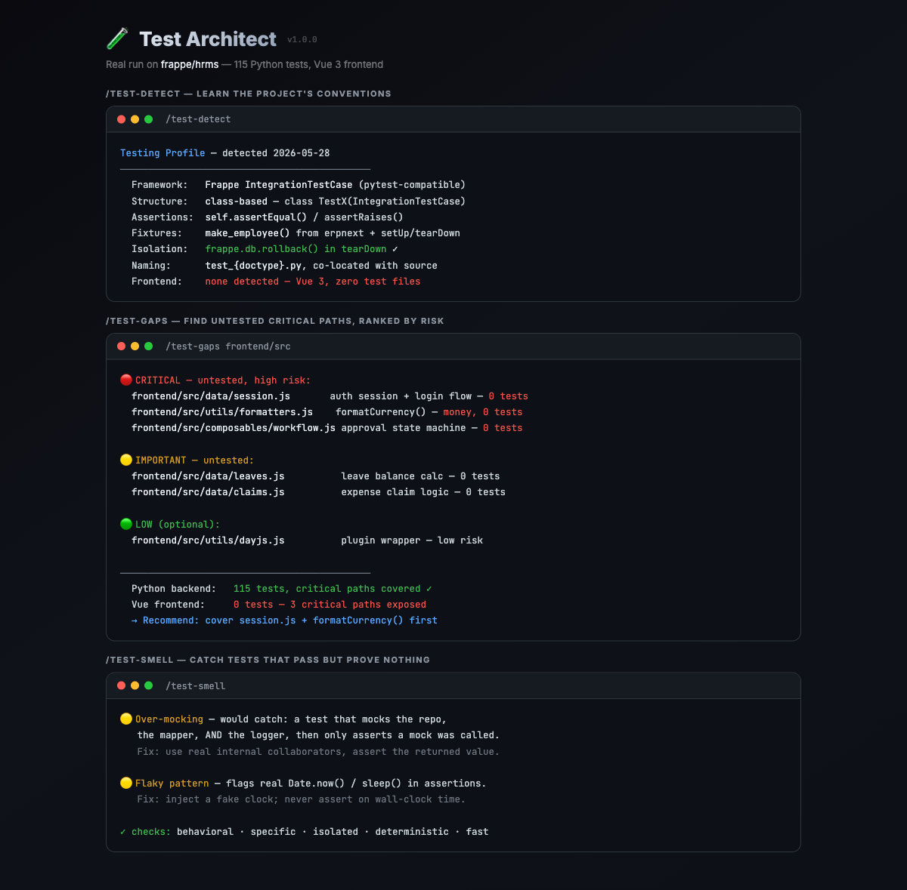

# 🧪 Test Architect

> A Claude Code skill that writes tests like your team would — and catches the ones that lie.

[](https://opensource.org/licenses/MIT)
[](https://claude.ai/claude-code)
[](https://skills.sh/mturac/test-architect)

Most AI-generated tests fail in one of three ways: they use the **wrong framework**, they test **implementation instead of behavior**, or they **over-mock** until the test proves nothing.

Test Architect fixes all three by reading your project's existing tests first and matching them exactly — then enforcing the discipline that makes a test suite actually catch bugs.



> A real run on [frappe/hrms](https://github.com/frappe/hrms): it learned the Frappe `IntegrationTestCase` conventions from the 115 existing Python tests, then flagged that the entire Vue frontend has **zero tests** — including the auth session flow and `formatCurrency()`.

---

## ✨ Commands

| Command | Description |
|---------|-------------|
| `/test-detect` | Detect the project's framework, assertion style, mocking strategy, and conventions |
| `/test-write [target]` | Write tests for a function/module in the project's exact style |
| `/test-tdd [feature]` | Run the red-green-refactor TDD loop, one behavior at a time |
| `/test-gaps [path]` | Find untested **critical paths**, ranked by risk (not line coverage) |
| `/test-smell [path]` | Detect over-mocking, flaky patterns, assertion-free tests, and other smells |

---

## 🚀 Installation

### Claude Code plugin

```
/plugin install test-architect@test-architect
```

### skills.sh

```bash
npx skills add mturac/test-architect
```

---

## 🧠 Why it's different

### It matches before it writes

Before writing a single test, `/test-detect` reads your config and 2–3 existing
test files to extract: framework, structure (`describe/it` vs `test()` vs
table-driven), assertion style, mocking approach, fixtures, and file naming.
New tests are indistinguishable from the ones your team already wrote.

### It tests behavior, not implementation

A good test survives a refactor. Test Architect asserts on observable outputs
and side effects — never on private methods or internal call order. Rename a
helper, and the test still passes.

### It covers what matters

100% coverage of getters is worthless. `/test-gaps` ranks untested code by
**risk** — auth, money, error handling, concurrency first — and reports
critical-path coverage, not a meaningless line-coverage number.

```
🔴 CRITICAL — untested, high risk:
  src/auth/token-refresh.ts:42  refreshToken() — no test for expired-token path
  src/payments/charge.ts:88     applyRefund() — no test for partial refund

Critical path coverage: 11/14 (79%)
```

### It catches tests that lie

`/test-smell` finds the tests that pass but prove nothing: over-mocking,
assertion-free tests, `sleep()`-based flakiness, snapshot abuse, and tests
coupled to implementation details.

---

## 📐 The quality bar

Every test it writes is:

| Property | Meaning |
|----------|---------|
| **Behavioral** | Survives a refactor that preserves behavior |
| **Specific** | Asserts a concrete value — never just "doesn't throw" |
| **Isolated** | No dependency on other tests or shared state |
| **Deterministic** | No real time, randomness, or network |
| **Fast** | Unit tests run in milliseconds |
| **Readable** | The name tells you what broke |

---

## 🌐 Supported frameworks

JavaScript/TypeScript (Vitest, Jest, Mocha, Playwright) · Python (pytest,
unittest) · Go (`testing`, testify) · Ruby (RSpec, Minitest) · Java/Kotlin
(JUnit, TestNG) · C#/.NET (xUnit, NUnit) · Rust (built-in) — and it adapts to
others by reading your existing tests.

---

## 🤝 Contributing

PRs welcome. The skill is pure instructions (no backend, no MCP server) — to
improve it, edit `skills/test-architect/SKILL.md` and the reference docs.

---

## 📜 License

MIT © Mehmet Turac
